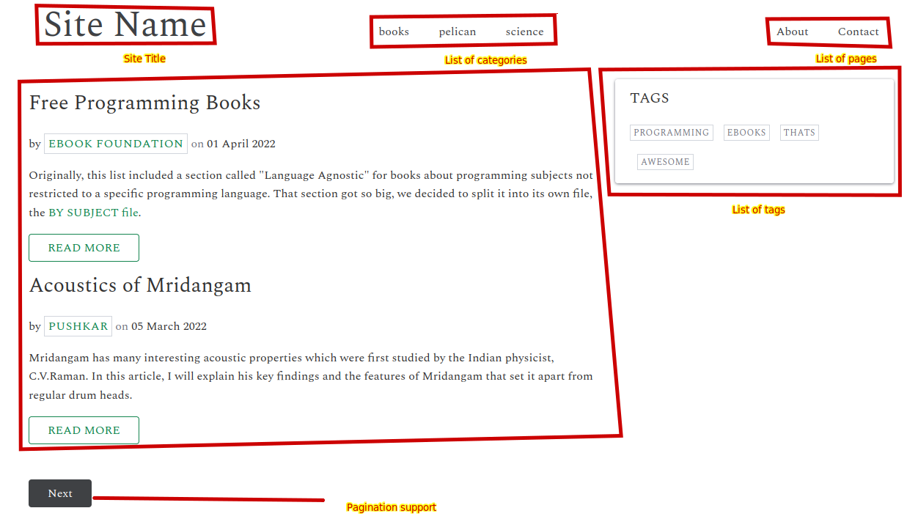
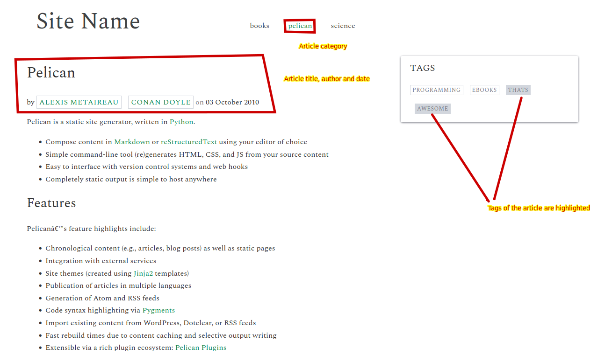
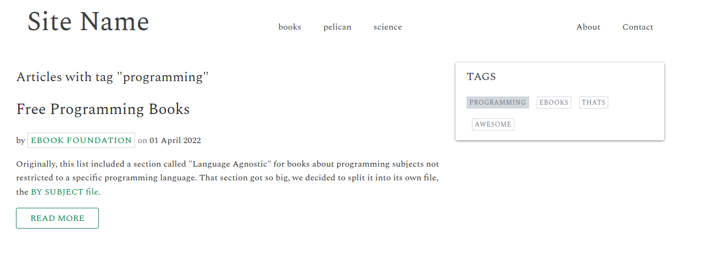

# classicpelicantheme
A 'classic' theme for Pelican static site generator.

A simple and classic theme for the pelican static site generator. 

## Standard Usage

Download the classicpelicantheme and run
```
pelican content -s pelicanconf.py -t /path/to/classicpelicantheme
```

## Features

* Pagination
* Tags and categories are well organized for easy navigation through the site, compared to default theme
* Responsive
* No support for drafts and archives

## Sample screenshots

### Index page



### Article page



### Search by tag, category or author


